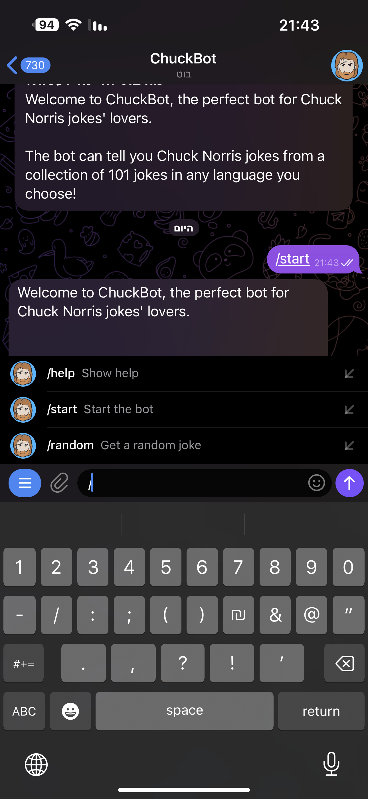
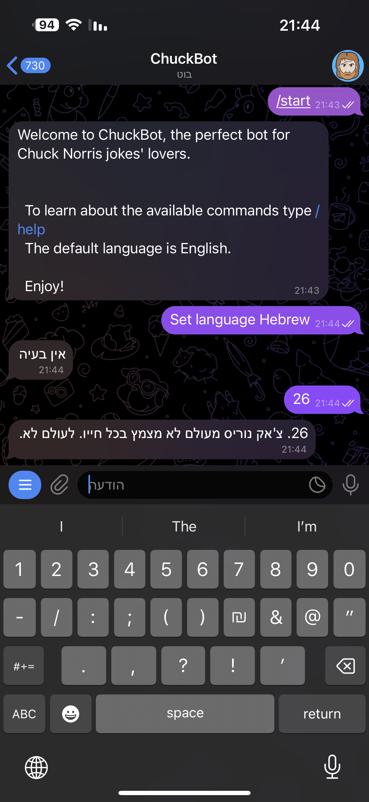

# ChuckBot - Chuck Norris Jokes Telegram Bot
ChuckBot is a Telegram bot written in Node.js and JavaScript that provides users with Chuck Norris jokes.
The bot utilizes web scraping to extract jokes from [the "101 Chuck Norris Jokes To Make You Laugh"](https://parade.com/968666/parade/chuck-norris-jokes/) website in real-time. 
Additionally, it leverages the Google Cloud Translate API to translate jokes from English to the user's preferred language. 
ChuckBot is deployed on AWS.  

#  Features
*  Real-time web scraping to fetch Chuck Norris jokes.
*  Translation of jokes from English to the user's preferred language.
*  User-friendly commands for setting language and requesting jokes.
*  Deployed on AWS EC2 instance for easy accessibility.

# How To Use
Start a conversation with ChuckBot by visiting the bot's page: [@Chuck_2023_bot](https://t.me/chuck_2023_bot)

# Commands
*  set language (Your Language): To set your language.
* (Number): To get a specific joke. The number must be in the range of 1 to 101.
* /random: Get a random joke.
* /start: Start the bot.
* /help: Show help.

# Screenshot

